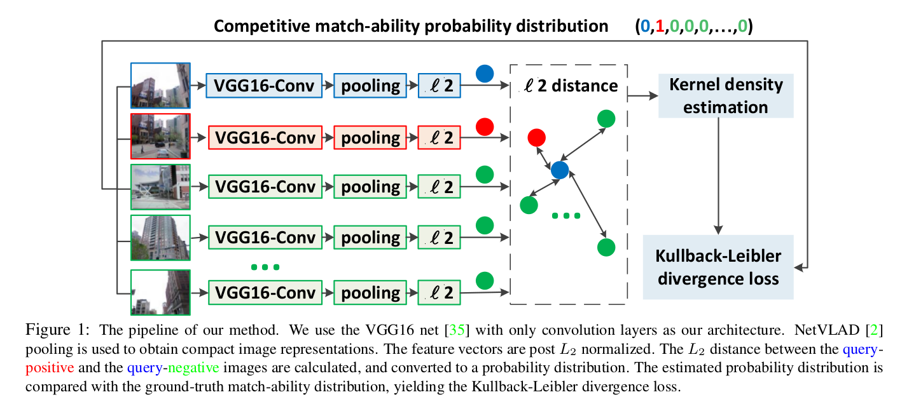
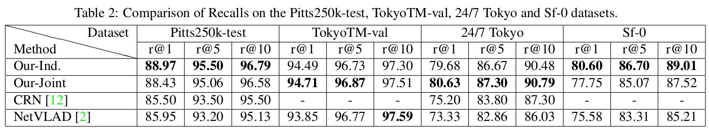

# Stochastic Attraction-Repulsion Embedding for Large Scale Localization

This contains the code and model for training ground-view geo-localization method described in: Stochastic Attraction-Repulsion Embedding for Large Scale Localization, ICCV2019. 

# Abstract
This paper tackles the problem of large-scale image-based localization (IBL) where the spatial location of a query image is determined by finding out the most similar reference images in a large database.  For solving this problem, a critical task is to learn discriminative image representation that captures informative information relevant for localization. We propose a novel representation learning method having higher location-discriminating power. It provides the following contributions: 1) we represent a place (location) as a set of exemplar images depicting the same landmarks and aim to maximize similarities among intra-place images while minimizing similarities among inter-place images; 2) we model a similarity measure as a probability distribution on $L_2$-metric distances between intra-place and inter-place image representations; 3) we propose a new Stochastic Attraction and Repulsion Embedding (SARE) loss function minimizing the KL divergence between the learned and the actual probability distributions; 4) we give theoretical comparisons between SARE, triplet ranking and contrastive losses. It provides insights into why SARE is better by analyzing gradients. Our SARE loss is easy to implement and pluggable to any CNN. Experiments show that the method improves localization performance on standard benchmarks by a large margin.  Demonstrating the broad applicability of our method, we obtain the $3^{rd}$ place out of 209 teams in the 2018 Google Landmark Retrieval Challenge. Our code and model are available at \url{https://github.com/Liumouliu/deepIBL}

# Codes and Models

## Overview
Our model is implemented in MatConvNet 1.0-beta25. Other versions should be OK.
You first need to download the NetVLAD code (https://github.com/Relja/netvlad), then run our training methods. 
Our pre-trained model by Gaussian kernel defined SARE loss (Our-Ind.) is available at: https://drive.google.com/file/d/1riu7rJEH4Eh5vhQ_tM8dBtUfwhKilqhq/view?usp=sharing

The model is VGG-16 + NetVLAD + whitening, trained on Pitts30k. The feature dimension is 4096. If you need feature embedding at smaller dimension, you can simply take the top-K elements, and then L_2 normalize it.

If you want to do some experiments on the above 4 datasets, please contact the original authors, not me.

For pre-trained model on CVUSA dataset, please download [CVUSA_model](https://drive.google.com/file/d/1oFUzLJkGXKLBabxYGzLNMSfeWW-gF3LP/view?usp=sharing)

For pre-trained model on CVACT dataset, please download [CVACT_model](https://drive.google.com/file/d/14Yd0-ICAaABQQlWaGjSkDsH8L3YUuML0/view?usp=sharing)

In the above [CVUSA_model](https://drive.google.com/file/d/1oFUzLJkGXKLBabxYGzLNMSfeWW-gF3LP/view?usp=sharing) and [CVACT_model](https://drive.google.com/file/d/14Yd0-ICAaABQQlWaGjSkDsH8L3YUuML0/view?usp=sharing),
we also include the pre-extracted feature embeddings, in case you want to directly use them.

Some may want to know how the training preformance improves along with epoches, please refer to 
[recalls_epoches_CVUSA](https://drive.google.com/file/d/15KN_N8Dc1FzRthDyW_1eeiAXWrGchzNv/view?usp=sharing) and [recalls_epoches_CVACT](https://drive.google.com/file/d/1l1pfw9PSkswk1phVWyHed_31FoG0ZsQM/view?usp=sharing).  

Some may want to know how the cross-view orientations are defined, please refer to [ground_view_orientations](./CVPR2019_codes/OriNet_CVUSA/CVUSA_orientations/yaw_pitch_grd_CVUSA.mat) and [satellite_view_orientations](./CVPR2019_codes/OriNet_CVUSA/CVUSA_orientations/yaw_radius_sat_CVUSA.mat)

If you use our codes or models in your research, please cite:

@article{liu2018deep,
  title={Deep Stochastic Attraction and Repulsion Embedding for Image Based Localization},
  author={Liu, Liu and Li, Hongdong and Dai, Yuchao},
  journal={arXiv preprint arXiv:1808.08779},
  year={2018}
}

If you need more pre-trained models, Please contact me. (Liu.Liu@anu.edu.au) 

