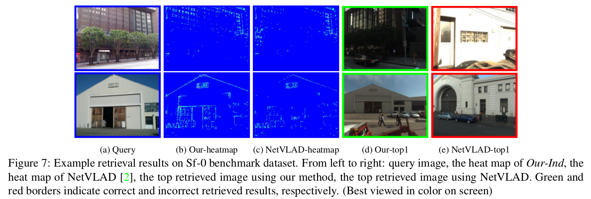

# Stochastic Attraction-Repulsion Embedding for Large Scale Localization

This contains the code and model for training ground-view geo-localization method described in: Stochastic Attraction-Repulsion Embedding for Large Scale Localization, ICCV2019. 

# Abstract
This paper tackles the problem of large-scale image-based localization (IBL) where the spatial location of a query image is determined by finding out the most similar reference images in a large database.  For solving this problem, a critical task is to learn discriminative image representation that captures informative information relevant for localization. We propose a novel representation learning method having higher location-discriminating power. It provides the following contributions: 1) we represent a place (location) as a set of exemplar images depicting the same landmarks and aim to maximize similarities among intra-place images while minimizing similarities among inter-place images; 2) we model a similarity measure as a probability distribution on $L_2$-metric distances between intra-place and inter-place image representations; 3) we propose a new Stochastic Attraction and Repulsion Embedding (SARE) loss function minimizing the KL divergence between the learned and the actual probability distributions; 4) we give theoretical comparisons between SARE, triplet ranking and contrastive losses. It provides insights into why SARE is better by analyzing gradients. Our SARE loss is easy to implement and pluggable to any CNN. Experiments show that the method improves localization performance on standard benchmarks by a large margin.  Demonstrating the broad applicability of our method, we obtain the $3^{rd}$ place out of 209 teams in the 2018 Google Landmark Retrieval Challenge. Our code and model are available at \url{https://github.com/Liumouliu/deepIBL}

# Codes and Models

## Overview
Our model is implemented in MatConvNet 1.0-beta25. Other versions should be OK.
You first need to download the NetVLAD code (https://github.com/Relja/netvlad), then run our training methods. 
Our pre-trained model by Gaussian kernel defined SARE loss (Our-Ind.) is available at: https://drive.google.com/file/d/1riu7rJEH4Eh5vhQ_tM8dBtUfwhKilqhq/view?usp=sharing

The model is VGG-16 + NetVLAD + whitening, trained on Pitts30k. The feature dimension is 4096. If you need feature embedding at a smaller dimension, you can simply take the top-K elements, and then L_2 normalize it.

From the above table, we can see that our method significantly outperforms the original NetVLAD on challenging Tokyo 24/7 and Sf-0 dataset. You can get some ideas why our trained CNN performs better from the following figure:

As can be seen, our method focuses on regions that are useful for image geo-localization while emphasizing the distinctive details on buildings. On the other hand, the original NetVLAD emphasizes local features, not the overall building style.

If you want to do some experiments on the above 4 datasets, please contact the original authors, not me.

## Codes

### Sample training script

~~~~
setup;

doPitts250k= false;

lr= 0.001;
   
dbTrain= dbPitts(doPitts250k, 'train');

dbVal= dbPitts(doPitts250k, 'val');

dbTest= dbPitts(doPitts250k, 'test');

% Gaussian kernel defined SARE loss (Our-Ind.)

sessionID= trainGaussKernalInd(dbTrain, dbVal, ...
    'netID', 'vd16','layerName', 'conv5_3', 'backPropToLayer', 'conv5_1', ...
    'method', 'vlad_preL2_intra', ...
    'learningRate', lr, ...
    'doDraw', true);

~~~~

### Testing notes

1. Since I have already included the PCA whitening weights, please do not add PCA layer again. That is to say, you need to comment the below lines in your testing codes:

~~~~
net= addPCA(net, dbTrain, 'doWhite', true, 'pcaDim', 4096);
~~~~

2. To do experiments on Tokyo 24/7 dataset, you need to resize query images (Only query, don't resize database images):

~~~~
ims_= vl_imreadjpeg(thisImageFns, 'numThreads', opts.numThreads, 'Resize', 640);
~~~~

You also need to convert all .png images to .jpg images to enable vl_imreadjpeg. You can use [convertPngtoJPG.m](./convertPngtoJPG.m) to do that.

# Publication

If you like, you can cite our following publication:

*Liu Liu; Hongdong Li; Yuchao Dai. Stochastic Attraction-Repulsion Embedding for Large Scale Localization. In IEEE International Conference on Computer Vision (ICCV), October 2019.*

@InProceedings{Liu_2019_ICCV,
author = {Liu, Liu and Li, Hongdong and Dai, Yuchao},
title = {Stochastic Attraction-Repulsion Embedding for Large Scale Localization},
booktitle = {The IEEE International Conference on Computer Vision (ICCV)},
month = {October},
year = {2019}
}

and also the following prior work:

1. Arandjelovic, Relja, et al. "NetVLAD: CNN architecture for weakly supervised place recognition." Proceedings of the IEEE conference on computer vision and pattern recognition. 2016.

# Contact

If you have any questions, drop me an email (Liu.Liu@anu.edu.au)

